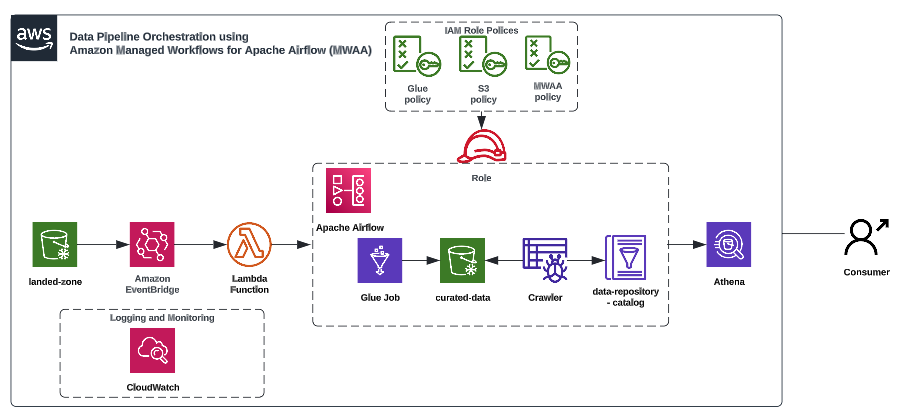

# Overview
Let's take a scenario where you must kick off the data pipeline when files land in the AWS S3 bucket, transform and save the data into S3 curated bucket, and crawl and catalog the curated data in the AWS Athena database table to run analytical queries without manual intervention. This blog post will walk you through step-by-step instructions for building data pipeline orchestration using Amazon Managed Workflow for Apache Airflow (MWAA). Below is the reference architecture for our use case;

**Data Pipeline Orchestration - Reference Architecture**

Click ***[here](https://medium.com/contino-engineering/data-pipeline-orchestration-using-amazon-managed-workflows-for-apache-airflow-mwaa-60e5b213a0a7)*** to read the blog post **"Data Pipeline Orchestration - Using Amazon Managed Workflows for Apache Airflow (MWAA)."**

# Prerequisite
1. Change the following parameter values in **etlscript.py** file
    - Change source and target S3 path with your S3 bucket path

2. Before running the CF template, change the following parameter values in **stack.yml** file
    - IAMRoleName
    - GlueJobName:
    - GlueCrawlerName:
    - GlueCatalogName:
    - GlueJobScriptLocation: Glue Job Script S3 bucket path
    - CrawlerS3Path: curated-data S3 bucket path

3. Change the following parameter values in **trigger_data_pipeline.py** file
    - mwaa_env_name: 'Enter MWAA Environment name'
    - dag_name: 'enter the DAG Name here'

4. Change the following paramter **data_pipeline_orchestration.py** file
    - DEFAULT_ARUG: Change the "Owner" property value
    - job_name = "YOUR GLUE CRAWLER NAME"
    - region_name= "AWS REGION NAME"
    - iam_role_name="YOUR MWAA IAM ROLE NAME"

    - config {
        "Name":"ATHENA CATALOG NAME",
        "Role": "AWS GLUE ROLE NAME",
        "DatabaseName":"ATHENA DATABASE NAME",
        "Description":"Crawl cars dataset and catalog the the data",
        'Targets':{'S3Targets' : [{'Path': "YOUR TARGET S3 BUCKET PATH" }]}
    } 
    - purge_processed_data_s3_objects = bashcommand = "YOUR S3 BUCKET PROCESSED FOLDER PATH"
    - purge_data_catalog: bash_command= "YOUR DATABASE NAME & CATALOG NAME"
    - run_glue_job:
        script_location="YOUR GLUE JOB SCRIPT S3 PATH",
        s3_bucket="YOUR S3 BUCKET NAME",
    - sync_buckets: bash_command="YOUR SOURCE AND TARGET S3 BUCKET PATH"
    - purge_raw_data_file: 
        bucket="YOUR S3 BUCKET NAME",
        keys="YOUR RAW DATA FILE NAME WITH S3 BUCKET PATH"

# Process Overview
1. Create an S3 bucket using GUI

2. Configure Amazon Managed Workflow for Apache Airflow(MWAA)
    - IAM Role: Create IAM roles and policies to use with MWAA.
    - S3 Bucket: S3 bucket to store your DAGs, plugins, and other Airflow files.
    - VPC and Subnet: To deploy an MWAA environment in a VPC and Subnet for secure and private network communication.
    - Security Groups: Create security groups to control MWAA environment access.
    - Monitoring and logging: Configure Amazon CloudWatch to monitor and log your MWAA environment.

3. Create the following AWS artifacts using the CloudFormation template:
    - IAM Role: Grant permission to AWS Glue and S3 services and attach this role with the AWS Glue job.
    - Glue Job: Converting CSV file to Parquet format and saving the curated file(s) into S3.
    - Crawler: Crawl and Catalog curated data using AWS Glue Crawler.
    - Catalog: Catalog the metadata of the process file.

5. Lambda function to trigger MWAA pipeline

4. Upload the CSV data files to S3 (Landing Zone) bucket

6. Query transformed data using AWS Athena